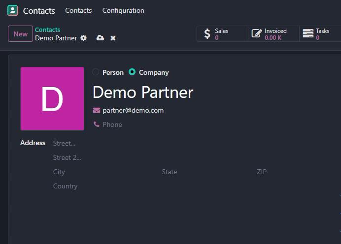
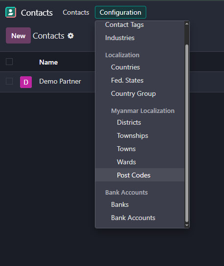
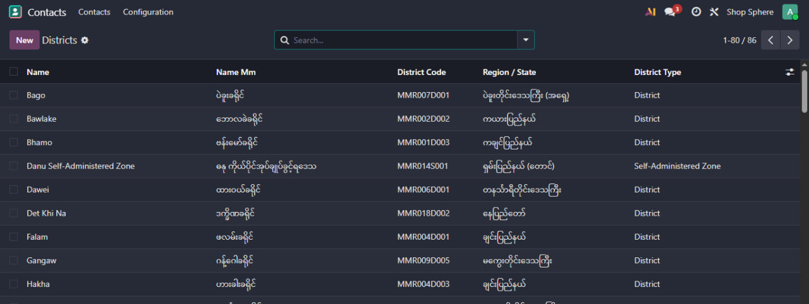
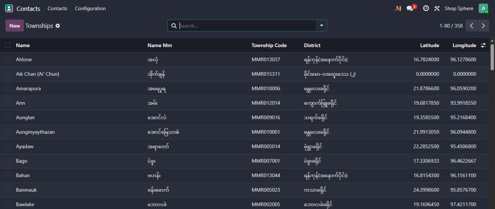
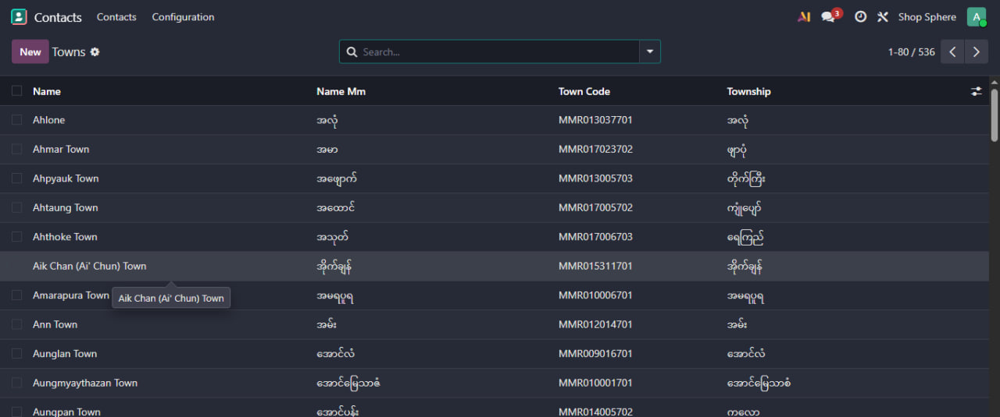
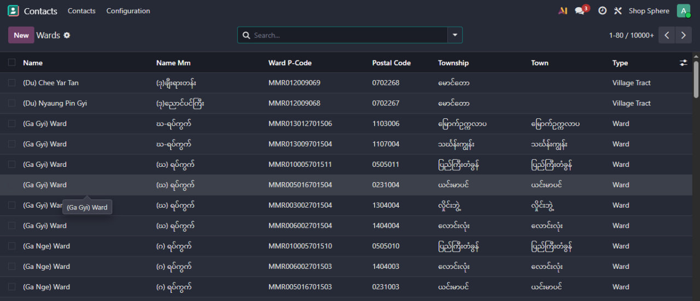
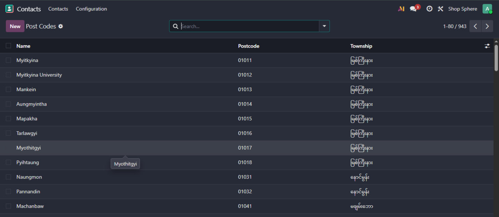

# Myanmar Address Localization (l10n_mm_address)

## Overview

**Myanmar Address Localization** is an Odoo 19 module developed by **Thein Htoo Aung** that provides the complete Myanmar administrative address hierarchy with full **MIMU P-code** integration for precise address management.

The module ships with pre-loaded official MIMU data covering all administrative levels from State/Region down to Ward and Village Tract, and integrates seamlessly into Odoo's contact forms with cascading dropdowns, auto-fill from P-Code, and map view support.

---

## Address Hierarchy

```
State/Region (res.country.state)
  └── District (res.district)
      └── Township (res.township)
          ├── Town (res.town)
          │   └── Ward / Village Tract (res.ward)
          └── Ward / Village Tract (res.ward)
```

---

## Features

* **18 States/Regions** — Myanmar administrative divisions
* **86 Districts** — Including Self-Administered Zones (SAZ) and Divisions (SAD)
* **358 Townships** — With 5-digit postal codes, latitude, and longitude coordinates
* **800+ Towns** — Linked to Townships
* **16,000+ Wards and Village Tracts** — With full MIMU P-code support
* **900+ Postal Codes** — 5-digit format linked to Townships
* **Cascading dropdowns** — State → District → Township → Town → Ward
* **Auto-fill from P-Code** — Enter a MIMU P-code to populate the full address
* **Auto-fill from Ward** — Selecting a Ward fills Township, District, State, and Country
* **Myanmar language names** — All records carry a `name_mm` field
* **Map view** — Partner locations displayed using township-level coordinates (centroid-based)
* **Computed full address** — `Myanmar Address` field assembles the complete address string

---

## P-Code Structure

MIMU P-codes are hierarchical codes up to 15 characters:

| Segment | Meaning | Example |
| --- | --- | --- |
| `MMR` | Country (Myanmar) | `MMR` |
| `001`–`018` | State/Region | `017` = Ayeyarwady |
| `D001`–`D333` | District (or `S`/`SAD`) | `D006` = Pyapon District |
| `001`–`358` | Township | `024` |
| `0001`–`9999` | Ward / Village Tract | `040` |

Example: `MMR017024040` = Myanmar → Ayeyarwady (017) → Pyapon District → Ward/Village Tract (040)

---

## District Types

| Type | Description |
| --- | --- |
| `district` | Regular administrative district |
| `saz` | Self-Administered Zone |
| `sad` | Self-Administered Division |

---

## Ward Types

| Type | Description |
| --- | --- |
| `ward` | Urban administrative ward |
| `village_tract` | Rural administrative division |

---

## Data Loaded on Installation

| Model | Records |
| --- | --- |
| `res.country.state` | 18 States/Regions |
| `res.district` | 86 Districts (incl. SAZ/SAD) |
| `res.township` | 358 Townships |
| `res.town` | 800+ Towns |
| `res.ward` | 16,000+ Wards and Village Tracts |
| `res.zip` | 900+ Postal Codes |

---

## Technical Details

### Models

| Model | Description |
| --- | --- |
| `res.district` | Districts, SAZ, SAD linked to State/Region |
| `res.township` | Townships with latitude/longitude coordinates |
| `res.town` | Towns linked to Townships |
| `res.ward` | Wards and Village Tracts with P-code and postal code |
| `res.zip` | Postal codes linked to Townships |
| `res.country` | Extended with `enforce_townships` field |

### Address Fields on `res.partner`

| Field | Description |
| --- | --- |
| `l10n_mm_district_id` | District, filtered by State |
| `l10n_mm_township_id` | Township, filtered by District |
| `l10n_mm_town_id` | Town, filtered by Township |
| `l10n_mm_ward_id` | Ward, filtered by Town or Township |
| `l10n_mm_pcode` | MIMU P-Code for auto-fill |
| `l10n_mm_zip_id` | Postal code, filtered by Township |
| `l10n_mm_full_address` | Computed full address display |
| `partner_latitude` | Related from Township latitude |
| `partner_longitude` | Related from Township longitude |

### Security

| Group | Permissions |
| --- | --- |
| `base.group_user` | Read |
| `base.group_partner_manager` | Read, Write, Create, Delete |

### Data Format

* All CSV data loaded via `data/` folder
* Ward P-codes: 15-character MIMU hierarchical code
* Postal codes: 5-digit format
* Coordinates: Decimal degrees (township centroid)

---

## Installation

### 1. Copy Module

```bash
cp -r l10n_mm_address /path/to/odoo/addons/
```

### 2. Update Apps List

In Odoo, go to **Apps → Update Apps List**.

### 3. Install

Search for `Myanmar Address Localization` and click **Install**.

---

## Usage

After installation:

* Browse all address data via **Contacts → Configuration → Myanmar Localization**
* On any contact form, set **Country** to `Myanmar` to reveal the Myanmar address fields
* Use the **P-Code** field to auto-fill the entire address hierarchy
* Enable **Use Myanmar Language** in **Settings → Contacts** to display names in Myanmar script

---

## Configuration

Go to **Settings → Contacts → Use Myanmar Language** to toggle Myanmar script display for all address fields across the hierarchy.

---

## Map View (Enterprise)

Partner locations are displayed on the map using **township-level accuracy**. Latitude and longitude are stored at the township level and represent the centroid of the township area. This provides accurate regional positioning while keeping data simple and maintainable.

---

## Demo

### Myanmar address auto-fill flow



This demo shows the Myanmar address workflow using the module's administrative address hierarchy and auto-fill behavior.

## Screenshots

### 1. Myanmar address menus



### 2. District master data



### 3. Township master data



### 4. Town master data



### 5. Ward / Village Tract master data



### 6. Postal code master data



## Data Included

- 18 States / Regions
- 86 Districts
- 358 Townships
- 536 Towns
- 17,531 Wards / Village Tracts
- 943 Postal Codes

## Future Enhancements

* Village-level coordinate precision
* Enhanced map clustering for dense urban areas
* Enforcement of township selection at country level (`enforce_townships`)

---

# Requirements

* Odoo 19
* Python 3.10+
* Docker (optional)
* PostgreSQL

---

## Developer

**Author:**
Thein Htoo Aung

**Company:**
Automated Resources Integrator Co., Ltd

Repository: [https://github.com/Zenonia-9/Myanmar-Administrative-Localization](https://github.com/Zenonia-9/Myanmar-Administrative-Localization)

---

## License

LGPL-3
